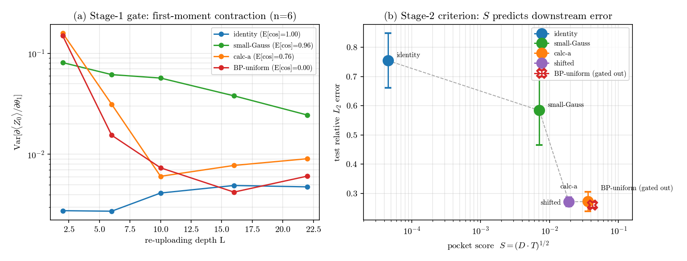
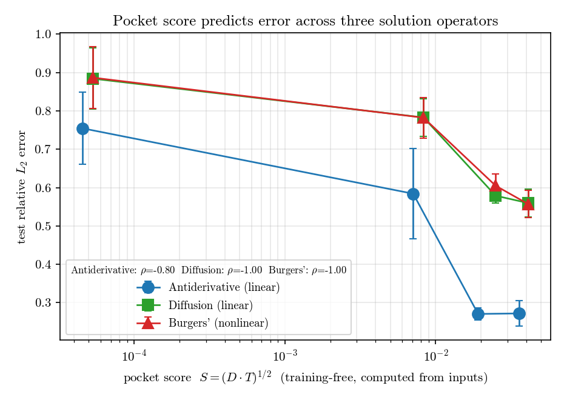

# Data-Aware Pocket Selection for Initializing Quantum DeepONets for PDEs

Code and paper for a **training-free initialization criterion** for the Quantum DeepONet
(QONet) applied to partial differential equations (PDEs). We extend the first-moment
barren-plateau framework in two ways:

1. **Data-averaged first-moment operator** — averages the Heisenberg-evolved readout over
   *both* the parameter ensemble and the PDE input-function ensemble, giving a computable
   **data-averaged operator gap** `D` that detects barren-plateau-free but "data-blind"
   initializations.
2. **Pocket-selection criterion** — a two-stage, training-free rule: a first-moment
   **validity gate**, then a **pocket score** `S = sqrt(D · T)` combining data alignment `D`
   with trainability `T`. It predicts the best initialization *before* any training.

Accepted-format submission for the **QC4PDE @ IEEE QCE 2026** workshop (Toronto, Sept 2026).

---

## Key result

Across three solution operators — an antiderivative, a diffusion (heat) propagator, and a
**nonlinear** Burgers' propagator — the pocket score `S`, computed from the inputs alone with
no training, predicts final test error and correctly rejects a trainable-but-data-blind
near-identity initialization (Spearman ρ = −0.8 / −1.0 / −1.0).




---

## Repository contents

```
QONet_Pocket_Selection.ipynb   # ★ start here — all code in one notebook (data → circuit → results → figures)
pocket_experiment.py           # standalone experiment (diagnostics, depth scan, training)
make_figure.py                 # regenerates the two figures from the result JSONs
results_antideriv.json         # saved results (5 seeds) — antiderivative operator
results_diffusion.json         # saved results (5 seeds) — diffusion operator
results_burgers.json           # saved results (5 seeds) — Burgers' operator
depth.json                     # first-moment depth-contraction data (Fig. 1a)
diag.json                      # per-family D, T, S diagnostics
pocket_selection.png           # Figure 1
pocket_generalization.png      # Figure 2
paper/main_ieee.tex            # IEEEtran LaTeX source (will be submitted)
paper/content.tex              # shared paper body (sections, equations, tables, refs) (will be submitted)
paper/main_preview.pdf         # compiled 4-page preview (will be submitted)
requirements.txt
```

---

## Quick start

### Option A — notebook (recommended)
```bash
pip install -r requirements.txt
jupyter notebook QONet_Pocket_Selection.ipynb   # Kernel → Restart & Run All
```
Full run is a few minutes on CPU and regenerates the result JSONs and both figures.

### Option B — scripts
```bash
python pocket_experiment.py diag                 # per-family D, T, S table
python pocket_experiment.py depth                # first-moment contraction vs depth (Fig. 1a)
python pocket_experiment.py all antideriv 400    # train all families, 5 seeds (also: diffusion, burgers)
python pocket_experiment.py all diffusion 400
python pocket_experiment.py all burgers 400
python make_figure.py                            # rebuild pocket_selection.png + pocket_generalization.png
```

---

## Method in one line

For each initialization family, we estimate two `O(1)`-sample, init-time quantities:

- `T = Var over inits of  d<Z_0>/d(theta_1)`  — **trainability** (gradient signal), and
- `D = mean_k E_theta Var_u[ b_k(u) ]`         — **data-averaged operator gap** (how much the
  branch readouts vary across the PDE inputs at init).

**Stage 1** keeps only families whose first moment `E[cos theta]` is bounded away from 0 (i.e.
not on the barren-plateau fixed point). **Stage 2** ranks the survivors by `S = sqrt(D·T)` and
picks the maximum. No training is needed to make the choice.

The circuit is the standard QONet branch/trunk: `SU(2)`/RY blocks with a fixed triangle-CX
entangler and angle data re-uploading, local Pauli-`Z` readout (PennyLane `default.qubit`,
JAX backprop).

---

## Reproducing the paper figures

The committed JSONs are the 5-seed / 400-epoch runs used in the paper. `python make_figure.py`
reads them and regenerates both figures verbatim. To recompute the numbers from scratch, run
Option A or the `pocket_experiment.py all ...` commands above.

---

## Building the paper

`paper/main_ieee.tex` uses the IEEE conference class:
```bash
cd paper
pdflatex main_ieee.tex   # requires IEEEtran.cls (bundled with TeX Live / available on Overleaf)
```

---

## Citation

```bibtex
@inproceedings{barati2026pocket,
  title     = {Data-Aware Pocket Selection for Initializing Quantum DeepONets for PDEs},
  author    = {Barati, Masoud and Wu, Jorgen and Givi, Peyman},
  booktitle = {QC4PDE Workshop, IEEE Quantum Week (QCE)},
  year      = {2026}
}
```

Built on the first-moment framework of A. Kulshrestha *et al.*, "Exponentially many
initializations to avoid barren plateaus," arXiv:2606.18515 (2026).

## License

Released under the MIT License (see `LICENSE`).
